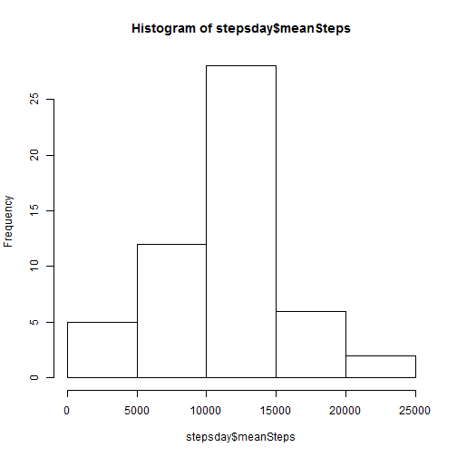
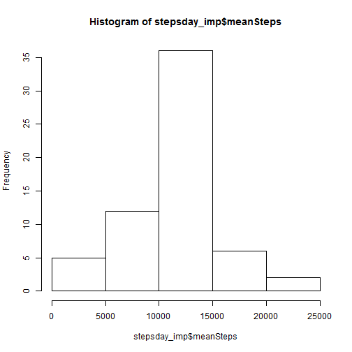

##Reproducible Research: Peer assessment 1

## Introduction

It is now possible to collect a large amount of data about personal
movement using activity monitoring devices such as a
[Fitbit](http://www.fitbit.com), [Nike
Fuelband](http://www.nike.com/us/en_us/c/nikeplus-fuelband), or
[Jawbone Up](https://jawbone.com/up). These type of devices are part of
the "quantified self" movement -- a group of enthusiasts who take
measurements about themselves regularly to improve their health, to
find patterns in their behavior, or because they are tech geeks. But
these data remain under-utilized both because the raw data are hard to
obtain and there is a lack of statistical methods and software for
processing and interpreting the data.

This assignment makes use of data from a personal activity monitoring
device. This device collects data at 5 minute intervals through out the
day. The data consists of two months of data from an anonymous
individual collected during the months of October and November, 2012
and include the number of steps taken in 5 minute intervals each day.

## Data

The data for this assignment can be downloaded from the course web
site:

* Dataset: [Activity monitoring data](https://d396qusza40orc.cloudfront.net/repdata%2Fdata%2Factivity.zip) [52K]

The variables included in this dataset are:

* **steps**: Number of steps taking in a 5-minute interval (missing
    values are coded as `NA`)

* **date**: The date on which the measurement was taken in YYYY-MM-DD
    format

* **interval**: Identifier for the 5-minute interval in which
    measurement was taken


The dataset is stored in a comma-separated-value (CSV) file and there
are a total of 17,568 observations in this
dataset.


## Assignment

This assignment will be described in multiple parts. You will need to
write a report that answers the questions detailed below. Ultimately,
you will need to complete the entire assignment in a **single R
markdown** document that can be processed by **knitr** and be
transformed into an HTML file.

Throughout your report make sure you always include the code that you
used to generate the output you present. When writing code chunks in
the R markdown document, always use `echo = TRUE` so that someone else
will be able to read the code. **This assignment will be evaluated via
peer assessment so it is essential that your peer evaluators be able
to review the code for your analysis**.

For the plotting aspects of this assignment, feel free to use any
plotting system in R (i.e., base, lattice, ggplot2)

Fork/clone the [GitHub repository created for this
assignment](http://github.com/rdpeng/RepData_PeerAssessment1). You
will submit this assignment by pushing your completed files into your
forked repository on GitHub. The assignment submission will consist of
the URL to your GitHub repository and the SHA-1 commit ID for your
repository state.

NOTE: The GitHub repository also contains the dataset for the
assignment so you do not have to download the data separately.


### Loading and preprocessing the data

Show any code that is needed to

1. Load the data (i.e. `read.csv()`)

2. Process/transform the data (if necessary) into a format suitable for your analysis

##Pre-work: Load packages, set nice APA-conform and neat theme for ggplot2


```r
library(stats)
library(ggplot2)

#Save ggplot2 theme settings as a function
#for the preferred ggplot2-theme of "Peter A. Edelsbrunner"
#for APA-coherence and neatness
theme_pety <- function(base_size = 12, base_family = "") {
  theme(text = element_text(size=20), #Larger text font size
        panel.background = element_rect(fill = 'white', colour = 'black'), #Figure background colour
        panel.grid.major=element_blank(), #Remove major grid
        panel.grid.minor=element_blank(), #Remove minor grid
        axis.text.x = element_text(colour="black"), #x-Axis text colour
        axis.text.y = element_text(colour="black")) #y-Axis text colour
}

#Set working directory
setwd("C:/Users/petere/Documents/4IV_Stud_Misc/Reproducible research/PA1")
```

```
## Error in setwd("C:/Users/petere/Documents/4IV_Stud_Misc/Reproducible research/PA1"): cannot change working directory
```
##Load data


```r
#Load data
ass1data <- read.csv("activity.csv", colClasses = c("integer", "Date", "factor"))
str(ass1data)
```

```
## 'data.frame':	17568 obs. of  3 variables:
##  $ steps   : int  NA NA NA NA NA NA NA NA NA NA ...
##  $ date    : Date, format: "2012-10-01" "2012-10-01" ...
##  $ interval: Factor w/ 288 levels "0","10","100",..: 1 226 2 73 136 195 198 209 212 223 ...
```

```r
attach(ass1data)
```

```
## The following objects are masked from ass1data (pos = 3):
## 
##     date, interval, steps
## 
## The following objects are masked from ass1data (pos = 5):
## 
##     date, interval, steps
```


### What is the mean total number of steps taken per day?

For this part of the assignment, you can ignore the missing values in
the dataset.

1. Make a histogram of the total number of steps taken each day


```r
#Extract mean steps per day
stepsday <- aggregate(x=ass1data$steps, by=list(date), FUN="sum")
str(stepsday)
```

```
## 'data.frame':	61 obs. of  2 variables:
##  $ Group.1: Date, format: "2012-10-01" "2012-10-02" ...
##  $ x      : int  NA 126 11352 12116 13294 15420 11015 NA 12811 9900 ...
```

```r
names(stepsday)[1] <- "day"
names(stepsday)[2] <- "meanSteps"

#Histogram of imputed dataset mean steps per day
hist(stepsday$meanSteps)
```

 

```r
#Report mean number of steps taken each day
mean(stepsday$meanSteps, na.rm=TRUE)
```

```
## [1] 10766.19
```

```r
#Report median number of steps taken each day
median(stepsday$meanSteps, na.rm=TRUE)
```

```
## [1] 10765
```

```r
#Extract average number of steps taken per interval across days
stepsinterval <- aggregate(x=steps, by=list(interval), FUN="mean", na.rm=TRUE)
names(stepsinterval)[1] <- "interval"
names(stepsinterval)[2] <- "meanSteps"
str(stepsinterval)
```

```
## 'data.frame':	288 obs. of  2 variables:
##  $ interval : Factor w/ 288 levels "0","10","100",..: 1 2 3 4 5 6 7 8 9 10 ...
##  $ meanSteps: num  1.717 0.132 0.321 40.566 26.981 ...
```

```r
#Plot average number of steps taken per interval in time series plot
stepstimeseries <- ggplot(stepsinterval, aes(x=interval, y=meanSteps)) +
  theme_pety() +
  theme(legend.position="none") +
  geom_point() +
  geom_line() + 
labs(title = "Time series plot of the intervals", x = "Interval", y = "Average number of steps taken")
stepstimeseries
```

```
## geom_path: Each group consist of only one observation. Do you need to adjust the group aesthetic?
```

 

2. Calculate and report the **mean** and **median** total number of steps taken per day


```r
#Report mean number of steps taken each day
mean(stepsday$meanSteps, na.rm=TRUE)
```

```
## [1] 10766.19
```

```r
#Report median number of steps taken each day
median(stepsday$meanSteps, na.rm=TRUE)
```

```
## [1] 10765
```


```r
#Extract interval with maximum number of steps
stepsinterval$interval[which.max(stepsinterval$meanSteps)]
```

```
## [1] 835
## 288 Levels: 0 10 100 1000 1005 1010 1015 1020 1025 1030 1035 1040 ... 955
```

```r
#Impute missing values with daily means
ass1data_imp <- ass1data
str(ass1data_imp)
```

```
## 'data.frame':	17568 obs. of  3 variables:
##  $ steps   : int  NA NA NA NA NA NA NA NA NA NA ...
##  $ date    : Date, format: "2012-10-01" "2012-10-01" ...
##  $ interval: Factor w/ 288 levels "0","10","100",..: 1 226 2 73 136 195 198 209 212 223 ...
```

```r
for (i in 1:nrow(ass1data_imp)) {
  if (is.na(ass1data_imp$steps[i])) {
    ass1data_imp$steps[i] <- stepsinterval[which(ass1data_imp$interval[i] == stepsinterval$interval), ]$meanSteps
  }
}
head(ass1data_imp)
```

```
##       steps       date interval
## 1 1.7169811 2012-10-01        0
## 2 0.3396226 2012-10-01        5
## 3 0.1320755 2012-10-01       10
## 4 0.1509434 2012-10-01       15
## 5 0.0754717 2012-10-01       20
## 6 2.0943396 2012-10-01       25
```

```r
sum(is.na(ass1data_imp))
```

```
## [1] 0
```

```r
#Create new dataset with imputed mean steps per day
stepsday_imp <- aggregate(x=ass1data_imp$steps, by=list(date), FUN="sum")
str(stepsday_imp)
```

```
## 'data.frame':	61 obs. of  2 variables:
##  $ Group.1: Date, format: "2012-10-01" "2012-10-02" ...
##  $ x      : num  10766 126 11352 12116 13294 ...
```

```r
names(stepsday_imp)[1] <- "day"
names(stepsday_imp)[2] <- "meanSteps"

#Histogram of imputed dataset mean steps per day
hist(stepsday_imp$meanSteps)
```

 

```r
#Report mean number of steps taken each day
mean(stepsday_imp$meanSteps)
```

```
## [1] 10766.19
```

```r
#Report median number of steps taken each day
median(stepsday_imp$meanSteps)
```

```
## [1] 10766.19
```

```r
#Differences between old and new (imputed) means and medians
mean(stepsday_imp$meanSteps)-mean(stepsday$meanSteps, na.rm=TRUE)
```

```
## [1] 0
```

```r
median(stepsday_imp$meanSteps)-median(stepsday$meanSteps, na.rm=TRUE)
```

```
## [1] 1.188679
```

```r
#Add variable indicating weekday to dataset
ass1data_imp$weekdays <- factor(format(ass1data_imp$date, "%A"))
levels(ass1data_imp$weekdays)
```

```
## [1] "Dienstag"   "Donnerstag" "Freitag"    "Mittwoch"   "Montag"    
## [6] "Samstag"    "Sonntag"
```

```r
levels(ass1data_imp$weekdays) <- list(weekday = c("Montag", "Dienstag",
                                      "Mittwoch", "Donnerstag", "Freitag"),
                                      weekend = c("Samstag", "Sonntag"))
levels(ass1data_imp$weekdays)
```

```
## [1] "weekday" "weekend"
```

```r
table(ass1data_imp$weekdays)
```

```
## 
## weekday weekend 
##   12960    4608
```

```r
#Aggregate number of steps taken on weekdays and weekenddays
mSteps <- aggregate(ass1data_imp$steps, 
                      list(interval = as.numeric(as.character(ass1data_imp$interval)), 
                           weekdays = ass1data_imp$weekdays),
                      FUN = "mean")
names(mSteps)[3] <- "meanSteps"

#Plot number of steps taken on weekdays and weekenddays
library(lattice)
xyplot(mSteps$meanSteps ~ mSteps$interval | mSteps$weekdays, 
       layout = c(1, 2), type = "l", 
       xlab = "Interval", ylab = "Number of steps")
```

 

### What is the average daily activity pattern?

1. Make a time series plot (i.e. `type = "l"`) of the 5-minute interval (x-axis) and the average number of steps taken, averaged across all days (y-axis)

2. Which 5-minute interval, on average across all the days in the dataset, contains the maximum number of steps?


### Imputing missing values

Note that there are a number of days/intervals where there are missing
values (coded as `NA`). The presence of missing days may introduce
bias into some calculations or summaries of the data.

1. Calculate and report the total number of missing values in the dataset (i.e. the total number of rows with `NA`s)

2. Devise a strategy for filling in all of the missing values in the dataset. The strategy does not need to be sophisticated. For example, you could use the mean/median for that day, or the mean for that 5-minute interval, etc.

3. Create a new dataset that is equal to the original dataset but with the missing data filled in.

4. Make a histogram of the total number of steps taken each day and Calculate and report the **mean** and **median** total number of steps taken per day. Do these values differ from the estimates from the first part of the assignment? What is the impact of imputing missing data on the estimates of the total daily number of steps?


### Are there differences in activity patterns between weekdays and weekends?

For this part the `weekdays()` function may be of some help here. Use
the dataset with the filled-in missing values for this part.

1. Create a new factor variable in the dataset with two levels -- "weekday" and "weekend" indicating whether a given date is a weekday or weekend day.

1. Make a panel plot containing a time series plot (i.e. `type = "l"`) of the 5-minute interval (x-axis) and the average number of steps taken, averaged across all weekday days or weekend days (y-axis). The plot should look something like the following, which was creating using **simulated data**:

 


**Your plot will look different from the one above** because you will
be using the activity monitor data. Note that the above plot was made
using the lattice system but you can make the same version of the plot
using any plotting system you choose.


## Submitting the Assignment

To submit the assignment:

1. Commit the your completed `PA1_template.Rmd` file to the `master` branch of your git repository (you should already be on the `master` branch unless you created new ones)

2. Commit your `PA1_template.md` and `PA1_template.html` files produced by processing your R markdown file with `knit2html()` function in R (from the **knitr** package)

3. If your document has figures included (it should) then they should have been placed in the `figures/` directory by default (unless you overrided the default). Add and commit the `figures/` directory to yoru git repository.

4. Push your `master` branch to GitHub.

5. Submit the URL to your GitHub repository for this assignment on the course web site.

In addition to submitting the URL for your GitHub repository, you will
need to submit the 40 character SHA-1 hash (as string of numbers from
0-9 and letters from a-f) that identifies the repository commit that
contains the version of the files you want to submit. You can do this
in GitHub by doing the following

1. Going to your GitHub repository web page for this assignment

2. Click on the "?? commits" link where ?? is the number of commits you have in the repository. For example, if you made a total of 10 commits to this repository, the link should say "10 commits".

3. You will see a list of commits that you have made to this repository. The most recent commit is at the very top. If this represents the version of the files you want to submit, then just click the "copy to clipboard" button on the right hand side that should appear when you hover over the SHA-1 hash. Paste this SHA-1 hash into the course web site when you submit your assignment. If you don't want to use the most recent commit, then go down and find the commit you want and copy the SHA-1 hash.

A valid submission will look something like (this is just an **example**!)

```r
https://github.com/rdpeng/RepData_PeerAssessment1

7c376cc5447f11537f8740af8e07d6facc3d9645
```
