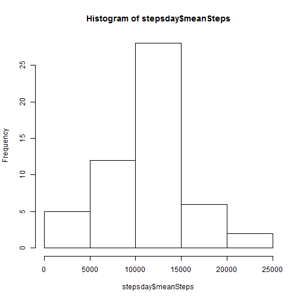
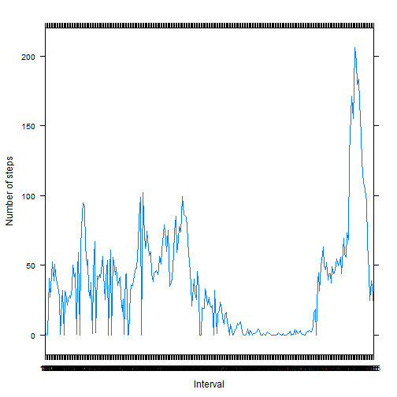
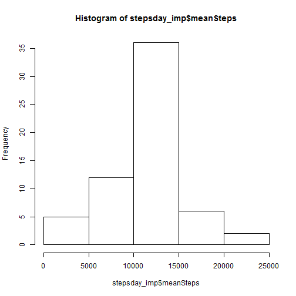

### Loading and preprocessing the data


```r
#Load data
ass1data <- read.csv("activity.csv", colClasses = c("integer", "Date", "factor"))
str(ass1data)
```

```
## 'data.frame':	17568 obs. of  3 variables:
##  $ steps   : int  NA NA NA NA NA NA NA NA NA NA ...
##  $ date    : Date, format: "2012-10-01" "2012-10-01" ...
##  $ interval: Factor w/ 288 levels "0","10","100",..: 1 226 2 73 136 195 198 209 212 223 ...
```

```r
attach(ass1data)
```


### What is the mean total number of steps taken per day?

For this part of the assignment, you can ignore the missing values in
the dataset.

1. Make a histogram of the total number of steps taken each day


```r
#Extract mean steps per day
stepsday <- aggregate(x=ass1data$steps, by=list(date), FUN="sum")
str(stepsday)
```

```
## 'data.frame':	61 obs. of  2 variables:
##  $ Group.1: Date, format: "2012-10-01" "2012-10-02" ...
##  $ x      : int  NA 126 11352 12116 13294 15420 11015 NA 12811 9900 ...
```

```r
names(stepsday)[1] <- "day"
names(stepsday)[2] <- "meanSteps"

#Histogram of mean steps per day
hist(stepsday$meanSteps)
```

 


2. Calculate and report the **mean** and **median** total number of steps taken per day


```r
#Report mean number of steps taken each day
mean(stepsday$meanSteps, na.rm=TRUE)
```

```
## [1] 10766.19
```

```r
#Report median number of steps taken each day
median(stepsday$meanSteps, na.rm=TRUE)
```

```
## [1] 10765
```

### What is the average daily activity pattern?

1. Make a time series plot (i.e. `type = "l"`) of the 5-minute interval (x-axis) and the average number of steps taken, averaged across all days (y-axis)


```r
#Extract average number of steps taken per interval across days
stepsinterval <- aggregate(x=steps, by=list(interval), FUN="mean", na.rm=TRUE)
names(stepsinterval)[1] <- "interval"
names(stepsinterval)[2] <- "meanSteps"
str(stepsinterval)
```

```
## 'data.frame':	288 obs. of  2 variables:
##  $ interval : Factor w/ 288 levels "0","10","100",..: 1 2 3 4 5 6 7 8 9 10 ...
##  $ meanSteps: num  1.717 0.132 0.321 40.566 26.981 ...
```

```r
library(lattice)
#Plot average number of steps taken per interval in time series plot
xyplot(stepsinterval$meanSteps ~ stepsinterval$interval, type = "l", 
       xlab = "Interval", ylab = "Number of steps")
```

 

2. Which 5-minute interval, on average across all the days in the dataset, contains the maximum number of steps?


```r
#Extract interval with maximum number of steps
stepsinterval$interval[which.max(stepsinterval$meanSteps)]
```

```
## [1] 835
## 288 Levels: 0 10 100 1000 1005 1010 1015 1020 1025 1030 1035 1040 ... 955
```

### Imputing missing values

1. Calculate and report the total number of missing values in the dataset (i.e. the total number of rows with `NA`s)


```r
#Total number of missing values
sum(is.na(ass1data))
```

```
## [1] 2304
```

2. Devise a strategy for filling in all of the missing values in the dataset. The strategy does not need to be sophisticated. For example, you could use the mean/median for that day, or the mean for that 5-minute interval, etc.


```r
#Impute missing values with daily means
ass1data_imp <- ass1data
str(ass1data_imp)
```

```
## 'data.frame':	17568 obs. of  3 variables:
##  $ steps   : int  NA NA NA NA NA NA NA NA NA NA ...
##  $ date    : Date, format: "2012-10-01" "2012-10-01" ...
##  $ interval: Factor w/ 288 levels "0","10","100",..: 1 226 2 73 136 195 198 209 212 223 ...
```

```r
for (i in 1:nrow(ass1data_imp)) {
  if (is.na(ass1data_imp$steps[i])) {
    ass1data_imp$steps[i] <- stepsinterval[which(ass1data_imp$interval[i] == stepsinterval$interval), ]$meanSteps
  }
}
head(ass1data_imp)
```

```
##       steps       date interval
## 1 1.7169811 2012-10-01        0
## 2 0.3396226 2012-10-01        5
## 3 0.1320755 2012-10-01       10
## 4 0.1509434 2012-10-01       15
## 5 0.0754717 2012-10-01       20
## 6 2.0943396 2012-10-01       25
```

```r
sum(is.na(ass1data_imp))
```

```
## [1] 0
```

3. Create a new dataset that is equal to the original dataset but with the missing data filled in.


```r
#Create new dataset with imputed mean steps per day
stepsday_imp <- aggregate(x=ass1data_imp$steps, by=list(date), FUN="sum")
str(stepsday_imp)
```

```
## 'data.frame':	61 obs. of  2 variables:
##  $ Group.1: Date, format: "2012-10-01" "2012-10-02" ...
##  $ x      : num  10766 126 11352 12116 13294 ...
```

```r
names(stepsday_imp)[1] <- "day"
names(stepsday_imp)[2] <- "meanSteps"
```

4. Make a histogram of the total number of steps taken each day and Calculate and report the **mean** and **median** total number of steps taken per day. Do these values differ from the estimates from the first part of the assignment? What is the impact of imputing missing data on the estimates of the total daily number of steps?


```r
#Histogram of imputed dataset mean steps per day
hist(stepsday_imp$meanSteps)
```

 

```r
#Report mean number of steps taken each day
mean(stepsday_imp$meanSteps)
```

```
## [1] 10766.19
```

```r
#Report median number of steps taken each day
median(stepsday_imp$meanSteps)
```

```
## [1] 10766.19
```

```r
#Differences between old and new (imputed) means and medians
mean(stepsday_imp$meanSteps)-mean(stepsday$meanSteps, na.rm=TRUE)
```

```
## [1] 0
```

```r
median(stepsday_imp$meanSteps)-median(stepsday$meanSteps, na.rm=TRUE)
```

```
## [1] 1.188679
```

```r
#Impact on total daily number of steps: How many percent does total number increase?
1-(sum(stepsday$meanSteps, na.rm=TRUE)/sum(stepsday_imp$meanSteps))
```

```
## [1] 0.1311475
```

### Are there differences in activity patterns between weekdays and weekends?

1. Create a new factor variable in the dataset with two levels -- "weekday" and "weekend" indicating whether a given date is a weekday or weekend day.


```r
#Add variable indicating weekday to dataset
ass1data_imp$weekdays <- factor(format(ass1data_imp$date, "%A"))
levels(ass1data_imp$weekdays)
```

```
## [1] "Dienstag"   "Donnerstag" "Freitag"    "Mittwoch"   "Montag"    
## [6] "Samstag"    "Sonntag"
```

```r
levels(ass1data_imp$weekdays) <- list(weekday = c("Montag", "Dienstag",
                                      "Mittwoch", "Donnerstag", "Freitag"),
                                      weekend = c("Samstag", "Sonntag"))
levels(ass1data_imp$weekdays)
```

```
## [1] "weekday" "weekend"
```

```r
table(ass1data_imp$weekdays)
```

```
## 
## weekday weekend 
##   12960    4608
```

2. Make a panel plot containing a time series plot (i.e. `type = "l"`) of the 5-minute interval (x-axis) and the average number of steps taken, averaged across all weekday days or weekend days (y-axis).


```r
#Aggregate number of steps taken on weekdays and weekenddays
mSteps <- aggregate(ass1data_imp$steps, 
                      list(interval = as.numeric(as.character(ass1data_imp$interval)), 
                           weekdays = ass1data_imp$weekdays),
                      FUN = "mean")
names(mSteps)[3] <- "meanSteps"

#Plot number of steps taken on weekdays and weekenddays
xyplot(mSteps$meanSteps ~ mSteps$interval | mSteps$weekdays, 
       layout = c(1, 2), type = "l", 
       xlab = "Interval", ylab = "Number of steps")
```

 
